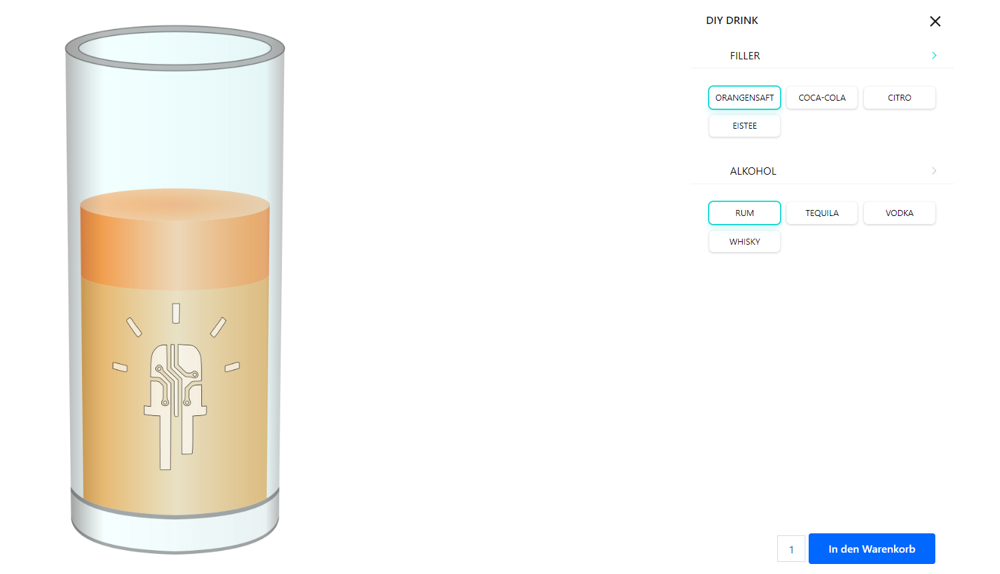

# eMakerspace-BarBot

Design your own drinks...
- Use a WordPress configurator to design a drink
- Pay the drink with Twint
- Grab the data with a python script over the WP API
- Control the roboter and make the drinks

