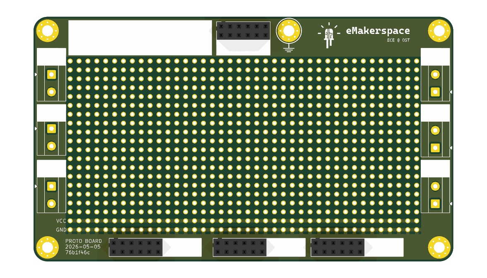
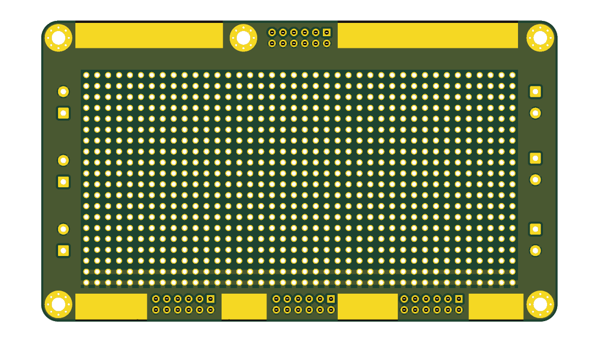
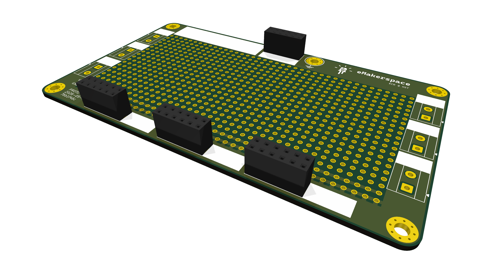
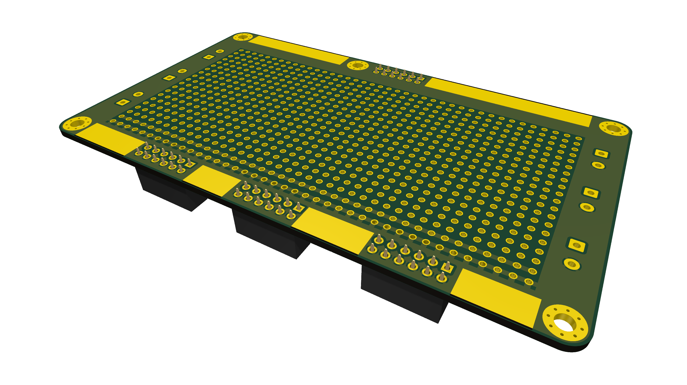
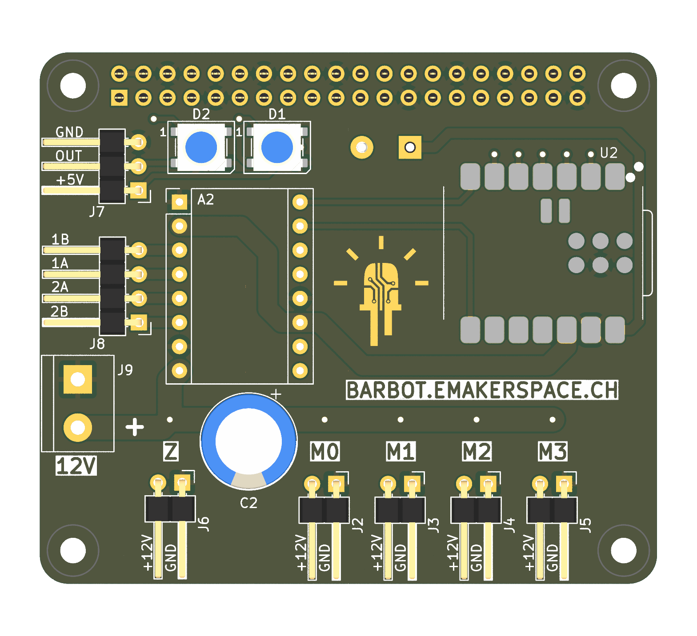
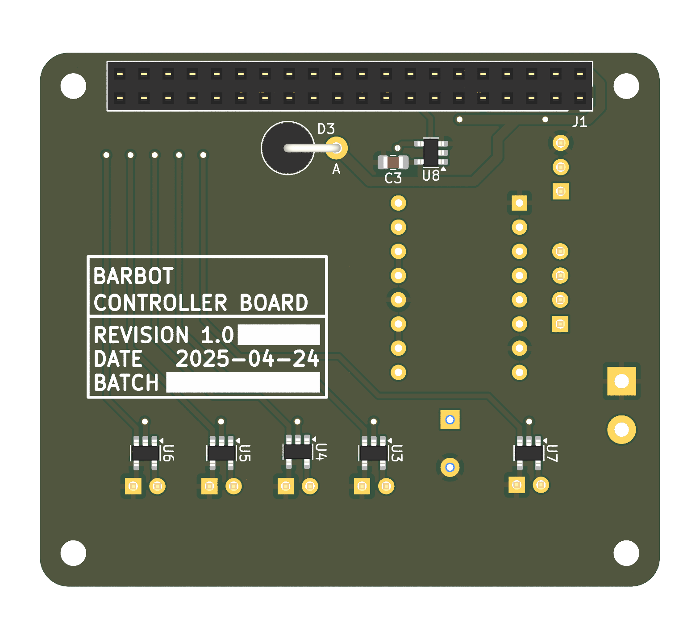
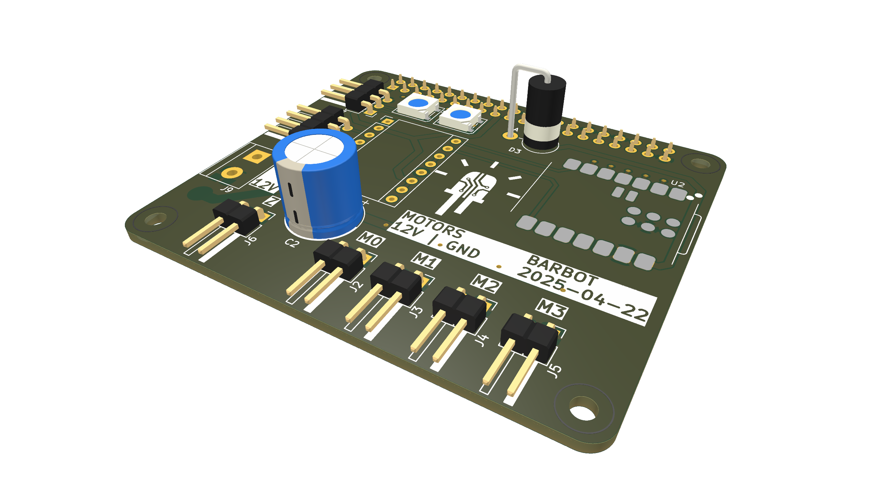
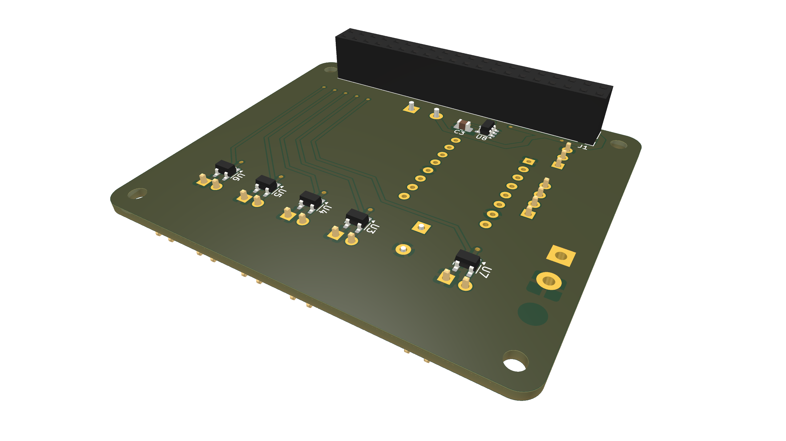

# Modular Hardware

- Nothing is fixed; it will change anyway...
- Make a solid base for creative hacking
- Everything based on ribbon cable
- No free flying hardware and sketchy cables
- Every cable is keyed, no wrong polarities.

| &nbsp;                                    | &nbsp;                                          |
| ----------------------------------------- | ----------------------------------------------- |
|        |        |
|  |  |

## Underling Architecture

- Different boards e.g.
    - IO
    - DC Motors with H-Bridge
    - Stepper motors
    - Proto board
    - Raspberry Pi
    - Main ESP

## BarBot HAT

First try with a fixed version, failed at the first adaption... ;-)

- Raspberry Pi HAT
- SEED Studio ESP32-C3
- One stepper motor driver
- Five 12V outputs, with a Tiny 1.5 A MOSFET Gate Driver
- Neopixel output

| &nbsp;                              | &nbsp;                                    |
| ----------------------------------- | ----------------------------------------- |
|        |        |
|  |  |
